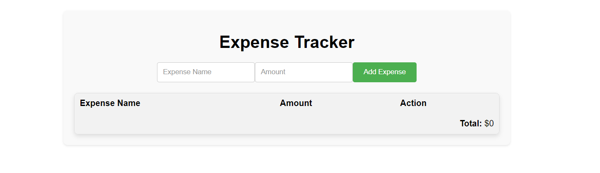

# Expense Tracker

This is a simple web application to track expenses. Users can add expenses with a name and amount, view the list of added expenses, and see the total amount spent.

# Getting Started

**Prerequisites**
To run this project, you will need a modern web browser like Google Chrome, Mozilla Firefox, or any other browser that supports HTML5, CSS3, and JavaScript.

**Installation**

1.  Clone the repository or download the source code

    ```bash
    git clone https://github.com/Bryan-Giitwa/EXPENSE-TRACKER.git
    ```

2.  Navigate to the project directory

    ```bash
    cd EXPENSE-TRACKER
    ```

3.  Open the `index.html` file in your browser

# Project Structure

1.  index.html: The main HTML file that contains the structure of the web page.
2.  style.css: The CSS file that styles the web page.

# Usage

Open index.html in a web browser.
You will see the "Expense Tracker" application interface.
Enter an expense name and amount in the form at the top of the page.
Click the "Add Expense" button to add the expense to the list.
The added expenses will be displayed in the table below the form.
The total amount of all added expenses will be displayed at the bottom of the table.

# Contributing

Contributions are welcome! If you would like to contribute, please follow these steps:

1. Fork the repository.
2. Create a new branch (git checkout -b feature-branch).
3. Make your changes and commit them (git commit -m 'Add new feature').
4. Push to the branch (git push origin feature-branch).
5. Open a pull request.
